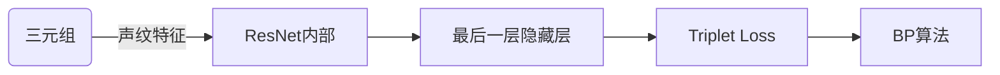
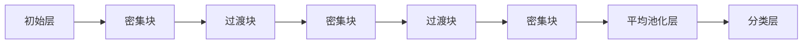
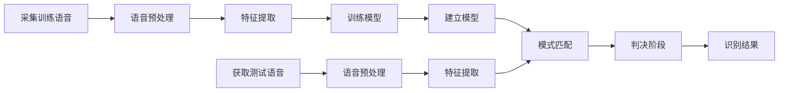
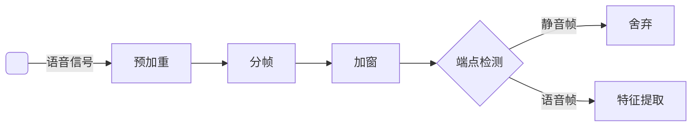
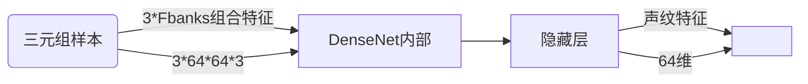
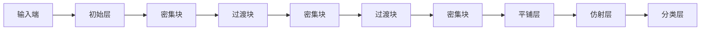
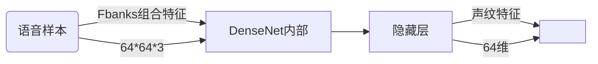

说话人识别（声纹识别）speaker recognition

- 目的：提取判别能力较强的声纹特征

- 改进损失函数提高识别精度

  - DenseNet 稠密型网络 作为声纹提取器，提取最后一层**隐藏层**的声纹特征
  - ICTL由三元组损失 Triplet Loss和改进的三元组损失 ICL 组成
    - ICTL作为目标函数，也是Softmax Loss的辅助损失函数，计算出提取的三元组特征之间的相似度损失
    - Softmax Loss计算出DenseNet最后一层**分类层**对应的三元组的预测身份与真实身份的误差损失
    - ICTL对监督层的监督使训练中输出的声纹特征的维度之间高度相关分布，即相同说话人的样本靠近
  - TCL 三元组中心损失思想
    - 提出两种增加类内约束的TCL损失函数作为DenseNet最后一层隐藏层的监督函数
    - 进一步增强提取的声纹特征与属于同一说话人样本特征中心之间的相似度的约束
    - 进而提高声纹特征的判别里，改善DenseNet分类层的识别效果

### 1 绪论

**特征提取**

- 目视法：语谱图

- 倒谱：提取基音的频率来估计语音的特征参数
  - 线性预测系数 LPC
  - 线性预测倒谱系数 LPCC
- 线性预测：使用过去若干个且是唯一的语音采样的线性组合
- 梅尔频率倒谱系数：MFCCs作为说话人的声音特征
- Fbanks：没有MFCCs的离散余弦变换 DCT
- 动态差分特征参数：利用语音信号的的动态连续特性，将动静态特征通过堆叠的方式相结合。
  - 动态差分MFCCs
  - 动态差分Fbanks

**模式匹配**

- 动态时间规整 DTW：寻找语音之间的最佳规整路径构造最优解来获取相似性
- 矢量量化 VQ：对语音数据编码形成说话人识别模型
- 概率模型法：基于参数的模式匹配方法，找出声纹特征信息的矢量分布规律，利用统计学原理构建模型
- HMM
- 高斯混合模型 GMM：利用多个高斯概率密度函数对输入信号进行概率建模。
- 高斯混合通用背景模型 GMM-UBM：把大量的非目标说话人混合训练，得到一个可以提供先验信息的通用背景模型。

- 联合因子分析 JFA：利用说话人声音信道差异性建立的说话人模型，很大程度上解决了语音信道不匹配的问题。
- 基于i-vector的说话人识别方法：通过将说话人语音和信道变化一起建模，并在识别阶段对超矢量进行补偿，解决了信道畸变；但是需要用不同的目标函数，训练步骤复杂，而且特征维度较高，计算量十分庞大。

深度学习

- 基于CNN/i-vector框架的说话人识别方法
- 基于3DCNN的说话人识别方法：同时捕捉时间和空间
- Deep Speaker识别系统：
  - 训练方法
    - 每次采集三个说话人样本。记作基准样本，正样本和负样本。
    - 基准样本和正样本属于同一说话人，基准样本与负样本属于不同说话人，构成三元组
    - 提取三元组Fbanks堆叠特征作为初始特征，输入到残差网络模型ResNet中
    - 从最后一层隐藏层中提取三者的低维特征向量
    - 采用三元组损失作为ResNet最后一层隐藏层的监督函数，来计算出基准样本与正负样本之间的相似度关系 
    - 训练神经网络并调参，拉近基准样本与正样本之间的距离，推远基准样本与负样本
    - 再次输入三个样本给ResNet，就能区分不同说话人
  - 不足
    - ResNet模型的训练参数非常庞大，随着网络训练参数的增多会造成过拟合的问题，只适合大语音样本集的声纹识别
    - 增加深度会产生过多的连乘和卷积，最终导致误差梯度的消失
    - 三元组损失只能扩大不同说话人之间的距离，不涉及同一说话人中不同语音片段的约束



- 稠密型网络：
  - 同样采用ResNet中的快捷连接方式将前层特征传送给后层
  - 但是在训练层数较少时，采取卷积通道级联的方式使网络中的每层卷积层都将接受前面所有卷积层的特征输出作为该卷积层的输入，提高了特征传播效率



- 密集块：依次经过$\mathrm{BN\text{、}Relu}、conv(n\times n)$
- 过渡块：经过$\mathrm{BN\text{、}Relu}\text{、}conv(1\times 1)$、$Average\ Poolig(2\times2)$，采用$conv(1\times1)$卷积层降低特征通道的数量，并使用局部平均池化层$Average\ Poolig(2\times2)$对特征图进行降采样。
- 隐藏层：采用全局平均池化层对最后一层的多维特征数据进行平均化，从而转换成一维的低维特征值
- 平均池化层：降低网络的参数，防止过拟合。
- 分类层：输出所有说话人对应的概率值。

### 2 基本概述

#### 2.1 分类

- 文本相关 文本无关
- 说话人辨认 说话人确认
- 开集识别 闭集识别

根据判别方式：

- 说话人辨认 SI（闭集识别）：把模型库中的语言特征与待识别的语音特征作匹配，进而判断未知语音的身份（一对多），如果需要辨认其他说话人，需要在训练阶段加入新的语音样本。
- 说话人确认 SV（开集识别）：判断识别阶段的未知说话人与模型库中对应的某个说话人是否匹配（一对一），验证识别的说话人声称的身份，不需要识别出每一个说话人，在识别阶段可以加入其他未知说话人样本，说话人识别系统不能知道冒名顶替者的实际身份。


根据说话人说话的内容：

- 文本相关的说话人识别：不能识别训练集语音所包含的文字内容之外的语音，识别结果好
- 文本无关的说话人识别：贴近现实，灵活多变，难度高

#### 2.2 原理

训练阶段



测试阶段

#### 2.3 语音特征提取

##### **预处理**



- 预加重
  - 原因：语音在高频能量衰减，导致离散傅里叶变换后的信号在高频处的 共振峰不明显，不利于特征分析和处理
  - 高频带通滤波器 $H(z)=1-\alpha z$，$\alpha$-预加重系数
  - 预加重后的语音信号 $y(n)=x(n)-\alpha x(n-1)$
- 分帧和加窗
  - 语音短时平稳
  - 帧位移：相邻帧信号有一半的重叠
  - 滑动窗口函数进行分帧
    - 矩形窗函数
    - 汉明窗函数：$w(n)=\left\{
      \begin{aligned}
      0.54-0.46\cos(\frac{2\pi n}{N-1}), & n=0,1,...,N-1\\
      0, & \text{其他}
      \end{aligned}
      \right.
      $
    - 加窗后的语音信号：$s_w(n)=y(n)\times w(n)$
- 端点检测
  - 找到目标语音信号和噪声出现的节点
  - 短时过零率 st-ZCR：根据时域信号的连续波形曲线与横坐标的交点个数来确定过零率
  - $Z_n=|sgn[x(n)]-sgn[x(n-1)]|w(n)$

##### **MFCCs**

- 通过梅尔滤波器组提取的语音特征参数

- 实际频率与梅尔频率的非线性关系$F_{mel}=2595\times\log_{10}(1+\frac{f}{700})$

- 提取流程

  ```mermaid
  graph LR
  P( )--语音信号-->A[预处理]-->B[FFT]-->C[Mel滤波器组]-->D[取对数]-->E[DCT]--MFCC-->F[ ];
  ```

- 离散功率谱$X(k)=\sum_{n=0}^{N-1}s_w(n)e^{-j2\pi nk/N},\ (0\leq n,k\leq N-1)$

- 谱估计

- MFCCs $C(i)=\sqrt{\frac{2}{N}}\sum_{k=1}^PS(i)\cos[(k-0.5)]\frac{i\pi}{P},i=1,2,...,M$，$M$为梅尔频率倒谱系数的维数，$P$是滤波器的个数。

##### **Fbanks堆叠特征**

- 去除MFCCs提取过程中的DCT倒谱运算可以获取Fbanks
- $\mathrm{Fbanks}+\Delta+\Delta^2$

#### 2.4 GMM识别系统

高斯混合模型：$\lambda={w_i,u_i,\sum_i} ,i=1,2,...,M$

期望最大化EM算法：迭代更新GMM中所有阴变量的极大后验概率估计

- 求出训练数据$X_D$出现在第$i$个高斯状态的概率粗略值
- 求解出权重、均值以及协方差矩阵的估计值

#### 2.5  深度学习

##### CNN

- 卷积层
- 激活函数
- 池化层
- 全连接层

##### ResNet

- 残差结构
- 快捷连接Shortcut Connections：跳过部分卷积层直接到输入层
- 跳跃连接一直打开

##### 梯度消失问题

- 使用ReLU函数作为网络的激活函数
- 在输入数据或者每层网络的输出进入激活函数之前，进行批量归一化 BN，将特征转换成均值为0、标准差为1的紧密分布形式，使之能够有效进入激活函数原点附近

##### 反向传播算法 BP算法

### 3 DenseNet-ICTL


#### 3.1 声纹特征的提取



DenseNet模型结构



- 平铺层：将DenseNet最后一个密集块输出的三维语音特征（16\*16\*80）压缩成一维特征即20480，保留上一层所有的声纹特征数据
- 仿射层：DenseNet的最后一层隐藏层，利用仿射变换来去除不相关的特征数据

#### 3.2 目标函数

- Triplet Loss
- 类内约束损失 ICL
- Softmax Loss

联合目标函数$L_{ICTL}=L_{SL}+\lambda_1(L_{TL}+\lambda_2 L_{ICL})，$$\lambda_2$表示$L_{ICL}$占$L_{TL}+\lambda_2 I_{ICL}$的权重大小，$\lambda_1$表示$L_{TL}+\lambda_2 I_{ICL}$占$L_{ICTL}$的权重大小。

#### 3.3 训练过程


#### 3.4 识别过程


#### 3.5 实验

系统性能评价指标

- 识别率 ACC $\mathrm{ACC}=\frac{\text{正确识别出的样本数}}{\text{待测样本总数}}\times 100\%$
- 等错误率 EER
  - 评价系统性能错误率的指标
    - 错误接受率 FAR $\mathrm{FAR}=\frac{\text{错误接受的样本数量}}{\text{冒充的样本数量}}\times 100\%$
    - 错误拒绝率 FRR $\mathrm{FRR}=\frac{\text{错误拒绝的样本数量}}{\text{说话人的样本总数量}}\times 100\%$
  - 在某一阈值下 FAR=FRR，此时二者叫做EER。

分析

- DenseNet增强了特征传播的效率，进而有效传递了训练误差，使网络的收敛速度加快。
- 高维且稀疏的样本数据导致隐藏层输出的声纹判别力不足，使Softmax难以找到分界点，使Softmax Loss计算出的损失值在反向传播训练的过程中出现分类器优化困难的问题。所以识别阶段不同说话人样本之间的距离仍然较近。
- 当识别人数较少时，DenseNet-ICTL系统的识别率相比ResNet-Triplet Loss系统具有较为明显的优势，而当识别人数逐渐增多时，DenseNet-ICTL系统识别率下降最为明显，但其识别效果仍然高于ResNet-Triplet Loss系统。
- 经过对网络中的参数训练之后，最后一层隐藏层可以很好的区别不同说话人样本的声纹特征，并按照不同说话人形成聚类。

问题

- Triplet Loss损失函数是一种高度依赖样本好坏的目标函数，挑选出不满足Triplet Loss的三元组才能很好地完成对DenseNet中参数的训练。
- 由于DenseNet-ICTL系统每次都至少需要挑选三个样本，导致最终训练的总样本集呈立方式增长，耗费时间相对较长且计算量庞大。

### 4 DenseNet-TCL

#### 4.1 声纹特征的提取



#### 4.2 目标函数

##### 三元组中心损失 TCL

- 结合Triplet Loss和Center Loss 类内中心损失
- 避免了挑选三元组样本来训练神经网络的复杂过程，使得网络为每一个类学习一个类样本中心

$L_{t c l}=\sum_{i=1}^{M} \max \left(D\left(x_{i}, c_{y_{i}}\right)+m-\min _{j \neq y_{i}} D\left(x_{i}, c_{j}\right), 0\right)$

其中, $D\left(x_{i}, c_{y_{1}}\right)$ 即为 Center Loss, 也即第 $i$ 个样本特征与同类特征中心之间的距离, 
$$
D\left(x_{i}, c_{y_{i}}\right)=\frac{1}{2} \sum_{i=1}^{M}\left\|x_{i}-c_{y_{1}}\right\|_{2}^{2}
$$
其中, $M$ 为训练批次的大小, $\|\varphi\|_{2}^{2}$ 为欧式距离的平方, $x_{i}$ 表示从网络的最后一层隐藏层提取的第 $i$ 个样本特征, $c_{y_{i}}$ 表示第 $y_{i}$ 个类别的特征中心。 $D\left(x_{i}, c_{j}\right)$ 为第 $i$ 个样本特征与非同类特征中心之间的距离， $m$ 表示不同类别的间隔。

##### 对数三元组中心损失 LTCL

- TCL中的类别间隔m只能控制不同类别样本之间的距离，导致分类层的识别效果不理想

- 目标函数$L_{LTCL}=L_{SL}+\lambda_1 L_{log-TCL}$，$\lambda_1$表示$L_{log-TCL}$占$L_{LTCL}$的权重大小。

##### 类内约束的三元组中心损失 ICTCL

类内约束损失ICL

- 将Center Loss作为TCL的额外约束项
- 拉开DenseNet网络最后一层隐藏层输出的不同特征中心之间的距离的同时，帮助DenseNet网络训练出各自最优的说话人特征中心
- 目标函数$L_{ICTCL}=L_{SL}+\lambda_2 L_{ICL}$，$\lambda_2$表示$L_{ICL}$占$L_{ICTCL}$的权重大小。

#### 4.3 训练过程


#### 4.4 识别过程


#### 4.5 实验

相同环境下，DenseNet-LTCL系统的识别效果高于Deep Speaker系统和DenseNet-TCL。

### 5 总结展望

展望

- 语音库单一，数据集不足，样本集不足，模型的超参数的调节
- 其他空间维度的距离测量方法
